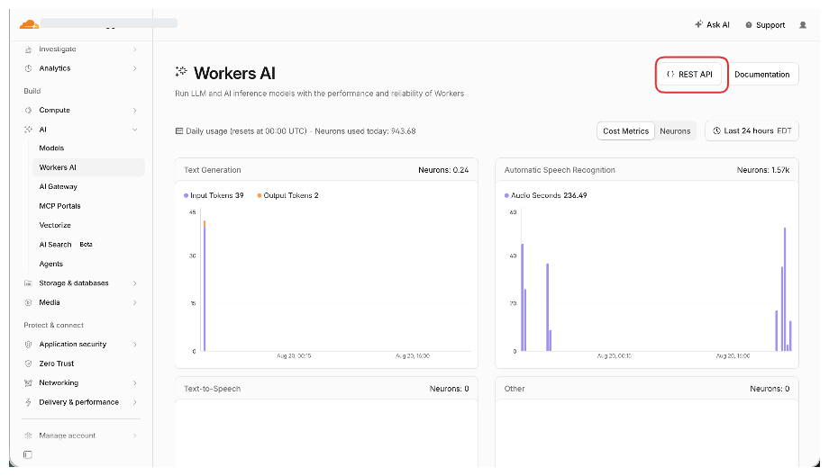
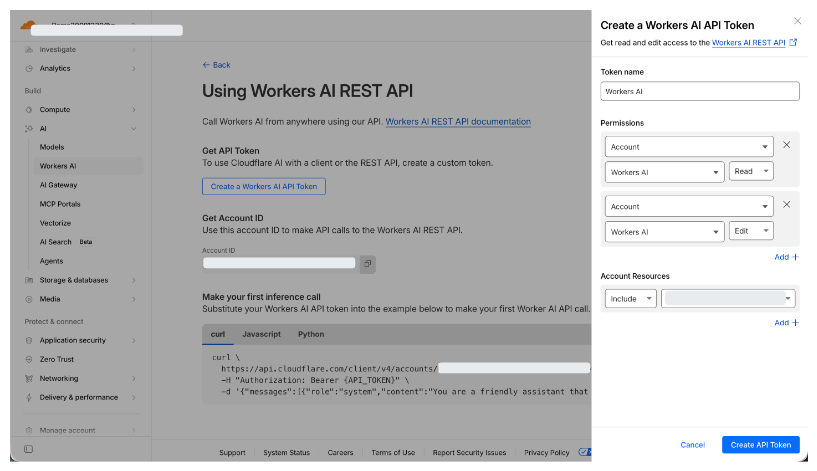
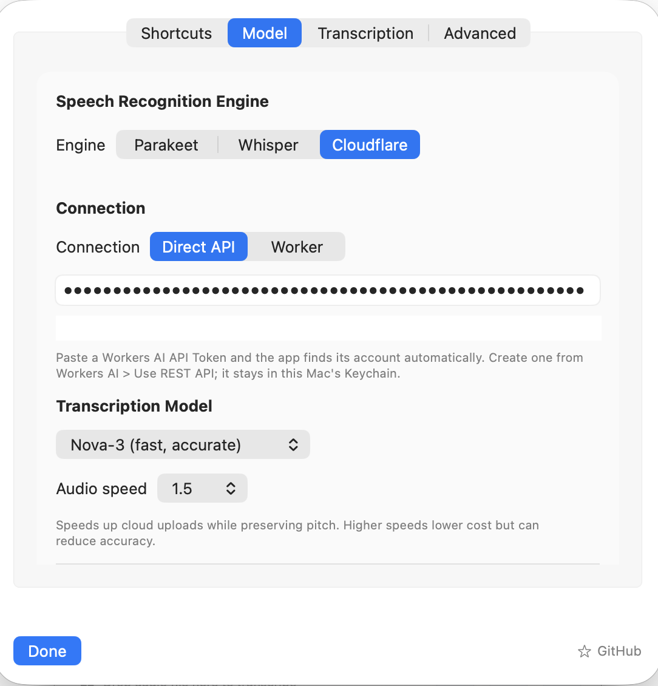

# cloud-dictation

Dictation for macOS that transcribes on Cloudflare Workers AI instead of on your Mac.

Hold a hotkey, speak, and the text lands in whatever app has focus.

Built on **[Starmel/OpenSuperWhisper](https://github.com/Starmel/OpenSuperWhisper)** (MIT)

## Why

Commercial dictation apps run $8 to $15 a month. Cloudflare gives 10,000 neurons per day free, on the free plan and the paid plan alike. For people who don't really use the free neurons, dictation would be a way to take advantage of that.

### Price

|Daily dictation|This, on Whisper base|This, on Nova-3|Wispr Flow|
|---|---|---|---|
|30 min|**$0**|$1.38/mo|$15/mo|
|1 hr|**$0**|$6.06/mo|$15/mo|

### Latency

|                   | This, on Whisper base | This, on Nova-3 | Wispr Flow         |
| ----------------- | --------------- | --------------- | ------------------------ |
| Latency, 9 s clip | ~1,250 ms       | **433 ms**      | <700 ms (vendor-claimed) |

## Install and configure - Direct API (recommended)

You do **not** need to deploy a Worker. The app can call Workers AI in your Cloudflare account directly.

1. **Download [OSW Cloud v0.1.0](https://github.com/Albatross679/cloud-dictation/releases/download/v0.1.0/OSW.Cloud.dmg)**, open the DMG, and drag `OSW Cloud.app` to `/Applications`. Or install with Homebrew: `brew install --cask albatross679/tap/osw-cloud`.
2. **Create a Cloudflare account** if you do not already have one.
3. In the Cloudflare dashboard, **AI in the left side panel -> Workers AI -> Rest API -> Create API Token**
   
   
4. On a fresh launch, the app walks you through creating, testing, and saving a Direct API token in one window. You can also open **Settings > Models > Engine > Cloudflare**; paste **only the API token**. Use **Test Connection** to surface an invalid token or account before dictating.
   

### Settings worth knowing

- **Transcription > Language.** Nova-3 serves ten languages and errors on the rest. For anything else pick `whisper-turbo`.
- **Transcription > Vocabulary.** A comma separated term list, not prose. `R2, Kubernetes, Workers AI`. It measurably fixes proper nouns.
- **Cloudflare > Audio speed.** Choose `1`, `1.25`, `1.5`, `1.75`, `2`, `2.25`, `2.5`, `2.75`, or `3`; default `1` uploads the original recording unchanged. Higher speeds preserve pitch and cut billed audio minutes, but trade accuracy for cost - see the measured WER deltas in [asr-compression-cost](https://github.com/Albatross679/asr-compression-cost). 1.5 is recommended.

## Other providers

Cloudflare is the default and the cheapest, but the same app can transcribe through **Hugging Face** or **OpenRouter** instead. Pick one under **Settings > Models > Engine > Provider**. Each provider keeps its own API key in its own Keychain entry, so switching never overwrites another key, and **Test Connection** works for all three.

### Hugging Face

1. Create a fine-grained access token at [huggingface.co/settings/tokens](https://huggingface.co/settings/tokens/new?ownUserPermissions=inference.serverless.write&tokenType=fineGrained) with the **Make calls to Inference Providers** permission.
2. Paste it into the key field. There is no account or endpoint to configure.

Models are `openai/whisper-large-v3-turbo` (default) and `openai/whisper-large-v3`. Those are the only two speech models the `hf-inference` provider serves warm; every other Whisper size answers "Model not supported by provider hf-inference", so the picker does not offer one.

Cost: Inference Providers bills per request against a free monthly credit allowance, with more credit on PRO. See [the pricing page](https://huggingface.co/docs/inference-providers/pricing) for current rates.

### OpenRouter

1. Create a key at [openrouter.ai/settings/keys](https://openrouter.ai/settings/keys) and add credit.
2. Paste it into the key field.

Models are `openai/whisper-large-v3-turbo` (default), `openai/whisper-large-v3`, `deepgram/nova-3`, `openai/gpt-4o-mini-transcribe`, and `openai/gpt-4o-transcribe`. OpenRouter serves 19 speech-to-text models in total; this list covers the three reasons to switch, which are matching the Cloudflare default, lowest cost, and highest accuracy.

Cost: pay per request with no subscription, at each upstream provider's rate plus OpenRouter's fee. Every response reports its own `usage.cost`, and the [activity page](https://openrouter.ai/activity) is the authority. Recordings are capped at 25 MB and upstream providers time out after about 60 seconds.

### What each provider can do

| | Cloudflare | Hugging Face | OpenRouter |
|---|---|---|---|
| Language pinning | yes, per model | **no**, the speech pipeline rejects a language parameter | yes, ISO-639-1 |
| Vocabulary boosting | yes, on Nova-3 and Whisper turbo | **no**, the pipeline takes no decoder prompt | **no**, the endpoint has no prompt field |
| Audio speed | yes | yes | yes |
| LLM cleanup | yes, on Workers AI | yes, on the HF router | yes, on OpenRouter |
| Neuron usage readout | yes | no, not a Cloudflare account | no, not a Cloudflare account |

Where a feature says no, the app disables the control and prints the reason next to it rather than accepting the setting and dropping it. Audio speed is applied on your Mac before the upload, so every provider honors it. The vocabulary list still reaches the cleanup pass as known spellings even where the recognizer cannot use it.

## Structure

```text
src/
├── index.js      router and auth gate
├── api/          request handling, auth, usage counter
├── core/         model registry, cleanup, vocabulary, language, metering
└── client/       the Swift engine added to OpenSuperWhisper, one file per provider

scripts/          patch, build, package, signing identity
docs/             the detail
runs/             generated, gitignored
repos/            upstream checkout, generated, gitignored
```

## Docs

- [docs/models.md](docs/models.md) - which model to pick, languages, vocabulary, measured accuracy and cost
- [docs/api.md](docs/api.md) - worker endpoints and parameters
- [docs/building.md](docs/building.md) - build requirements, signing, packaging, reproducibility
